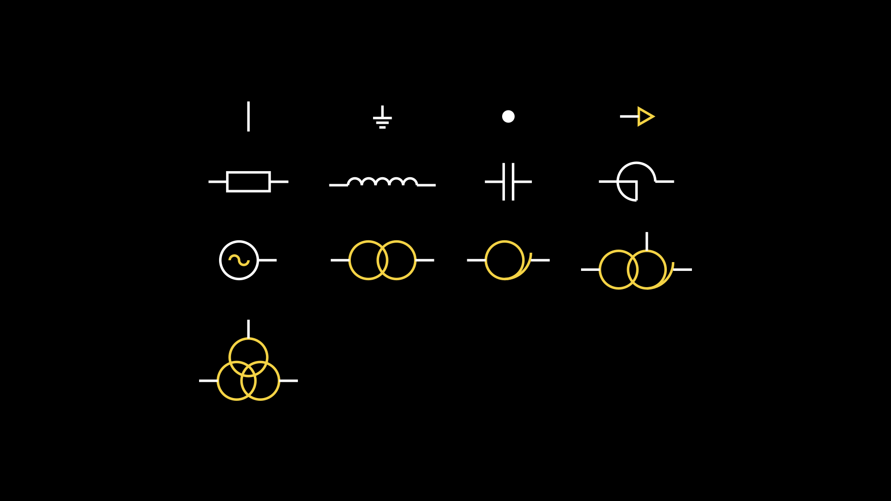

# Manim in electrical engineering

基于**Manim社区版v0.18.1**。

电气工程Manim（Manim in electrical engineering, ManimEE）旨在通过Manim绘制电气工程相关的元件，创作有关动画。

# 效果图

> 正在制作中……

# TODO List

- [x] 基础元件绘制
- [ ] 初步实现自动连线
- [ ] 动画的细节调控
- [ ] 支持显示网络潮流
- [ ] 支持网络潮流变化及其动画效果
